# 🌐 Network Traffic Analysis with Wireshark

> Hands-on network traffic analysis project demonstrating packet inspection, DNS analysis, protocol hierarchy evaluation, and network communication investigation using Wireshark.

---

## 📑 Table of Contents

- Overview
- Lab Environment
- Objectives
- Methodology
- Analysis
- Findings
- Skills Demonstrated
- Future Improvements

---

              Internet
                  │
                  │
        +------------------+
        | Cloudflare DNS   |
        |    1.1.1.1       |
        +------------------+
                  │
                  │
          Home Wi-Fi Router
                  │
                  │
        +------------------+
        | Windows 11 PC    |
        | Wireshark 4.6.6  |
        +------------------+

---

## 1. DNS Traffic Filtering

The `dns` display filter was applied to isolate Domain Name System (DNS) traffic from the complete packet capture. This allows the analysis to focus exclusively on DNS queries and responses while excluding unrelated network traffic.

The packet list shows multiple DNS requests sent from the local workstation (`192.168.0.101`) to the Cloudflare public DNS resolver (`1.1.1.1`), along with the corresponding responses. The lower packet details pane displays the protocol stack, including the Ethernet II, IPv4, UDP, and DNS layers for the selected packet.

### Why It Matters

Filtering network traffic is one of the first steps in packet analysis. It enables analysts to quickly locate relevant communication, investigate name resolution processes, and identify unusual or potentially malicious DNS activity.

### Findings

- Successfully filtered DNS traffic using the `dns` display filter.
- Observed DNS communication between the local host (`192.168.0.101`) and the Cloudflare DNS server (`1.1.1.1`).
- DNS traffic was transported over UDP (port 53).
- Multiple DNS queries and responses were captured during normal browsing activity.
- The packet details confirm protocol encapsulation from Ethernet II through IPv4 and UDP to the DNS application layer.

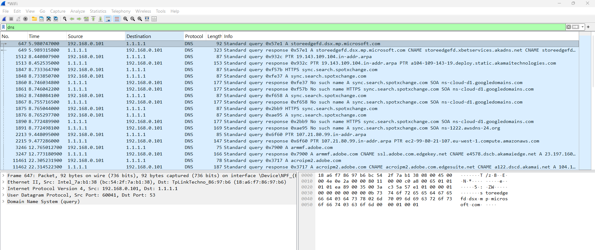

## 2. Protocol Hierarchy

The **Protocol Hierarchy Statistics** view was used to examine the protocols present in the captured network traffic. This feature provides a structured overview of the protocol stack and shows how packets are distributed across different network layers.

The analysis confirms that all captured packets followed the expected protocol encapsulation:

**Ethernet II → IPv4 → UDP → DNS**

The statistics indicate that DNS traffic accounted for all filtered packets, while UDP served as the transport protocol carrying DNS requests and responses.

### Why It Matters

The Protocol Hierarchy view provides a quick summary of the protocols observed in a packet capture. It helps analysts verify that the expected protocols are present, detect unexpected traffic, and understand how network communication is encapsulated across the OSI model.

### Findings

- All filtered packets were identified as DNS traffic.
- DNS communication was transported over UDP.
- IPv4 was used as the network layer protocol.
- Ethernet II provided Layer 2 encapsulation.
- No unexpected protocols were observed in the filtered capture.

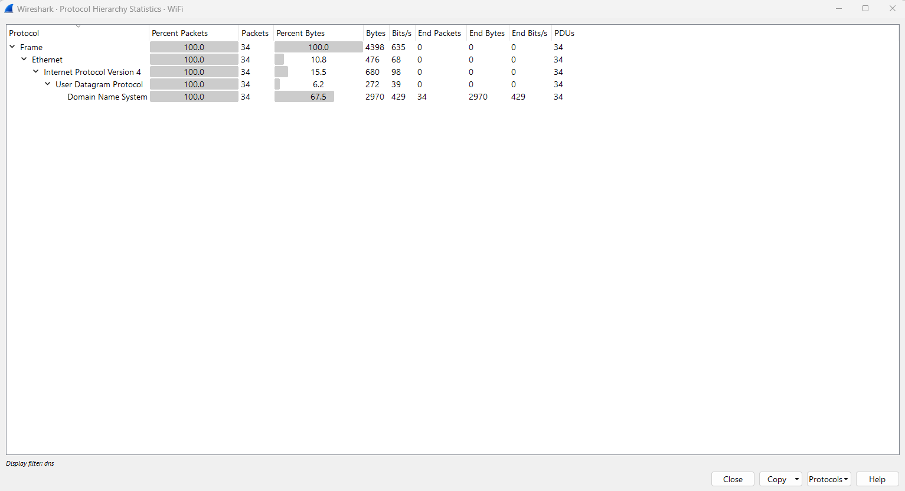

## 3. IPv4 Endpoints

The **IPv4 Endpoints** statistics were used to identify the hosts participating in the captured DNS communication. This view provides information about each endpoint, including the number of transmitted and received packets, transferred bytes, and communication statistics.

The analysis identified two active IPv4 endpoints:

- **192.168.0.101** – the local workstation generating DNS requests.
- **1.1.1.1** – the Cloudflare public DNS resolver responding to those requests.

The statistics confirm successful bidirectional communication between the client and the DNS server during the packet capture.

### Why It Matters

Endpoint analysis helps identify which devices participate in network communication. It is an essential step in network monitoring, troubleshooting, and security investigations, as it allows analysts to distinguish legitimate hosts from unknown or suspicious systems.

### Findings

- Two IPv4 endpoints were identified.
- The local host (`192.168.0.101`) initiated DNS requests.
- The Cloudflare DNS server (`1.1.1.1`) responded to the queries.
- Traffic was exchanged in both directions, confirming normal DNS communication.
- No unexpected or unknown IPv4 endpoints were detected in the filtered capture.

## 4. IPv4 Conversations

The **IPv4 Conversations** view was used to analyze communication between network hosts during the DNS packet capture. Unlike the Endpoints view, Conversations focuses on individual communication sessions between two devices and provides statistics for each exchange.

The capture shows a single IPv4 conversation between the local workstation (`192.168.0.101`) and the Cloudflare public DNS resolver (`1.1.1.1`). The statistics include the number of transmitted and received packets, transferred bytes, communication duration, and traffic direction.

### Why It Matters

Conversation analysis helps security analysts understand how devices communicate with each other. It is useful for identifying communication patterns, measuring traffic volumes, detecting unusual connections, and investigating potential security incidents.

### Findings

- One IPv4 conversation was identified during the capture.
- Communication occurred between the local workstation (`192.168.0.101`) and the Cloudflare DNS server (`1.1.1.1`).
- DNS traffic was exchanged in both directions, confirming successful query and response communication.
- The statistics include packet counts, transferred bytes, communication duration, and transmission rates.
- No additional or unexpected IPv4 conversations were observed in the filtered DNS traffic.

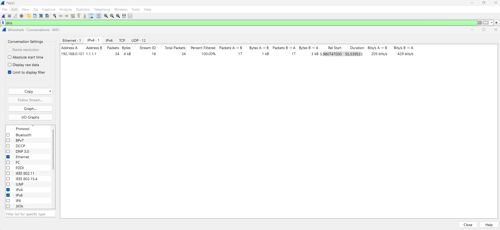

## 5. DNS Query Analysis

This screenshot presents the detailed structure of a DNS query packet captured during the analysis. The selected packet represents a standard DNS request sent by the local workstation to the Cloudflare DNS resolver (`1.1.1.1`).

The packet details include the DNS Transaction ID, query flags, and the number of resource records contained within the request. The **Response In** field links this query to its corresponding DNS response, allowing the complete request–response transaction to be traced.

### Why It Matters

Analyzing DNS query packets helps security analysts understand how domain name resolution is initiated. Reviewing transaction identifiers and DNS header fields is essential for troubleshooting DNS issues, validating normal communication, and investigating suspicious or malicious DNS activity.

### Findings

- A standard DNS query was generated by the local workstation.
- The request was sent to the Cloudflare DNS resolver (`1.1.1.1`) over UDP port 53.
- The DNS header contains a unique Transaction ID used to match the response.
- One DNS question was included in the request.
- The **Response In** field provides a direct reference to the corresponding DNS response packet.

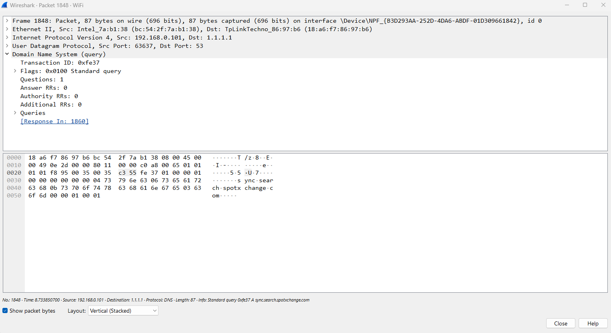

## 6. DNS Response Analysis

This screenshot presents the DNS response corresponding to the previously captured query. The response was received from the Cloudflare public DNS resolver (`1.1.1.1`) and contains detailed information about the DNS transaction.

The selected packet indicates a **Standard Query Response** with the status **"No such name" (NXDOMAIN)**. This means that the requested domain could not be resolved because no matching DNS record exists. The response also includes an **Authority** section, which identifies the authoritative name server responsible for the queried domain.

### Why It Matters

Analyzing DNS responses is essential for understanding the outcome of name resolution requests. Response codes such as **NXDOMAIN** help analysts distinguish between successful lookups, configuration issues, and potential indicators of suspicious activity during network investigations.

### Findings

- A DNS response was successfully received from the Cloudflare DNS resolver (`1.1.1.1`).
- The response matched the original DNS query using the same Transaction ID.
- The response status was **NXDOMAIN (No such name)**, indicating that the requested domain could not be resolved.
- The packet includes an Authority section containing information about the authoritative DNS server.
- The query and response were successfully correlated, demonstrating the complete DNS request–response process.

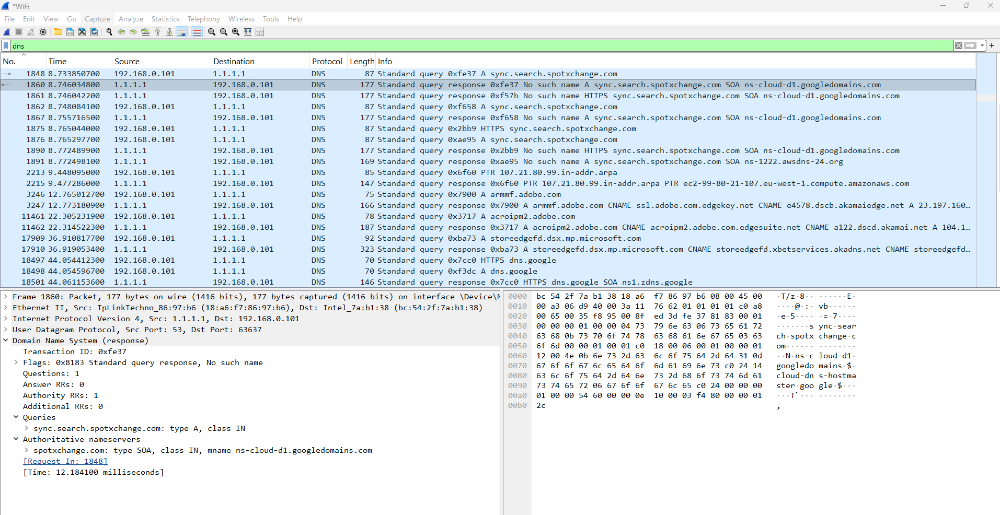

## 7. UDP Packet Analysis

This screenshot presents the **User Datagram Protocol (UDP)** header of the selected DNS packet. UDP is the transport layer protocol used by standard DNS queries because it provides fast, connectionless communication with minimal overhead.

The packet details display the source and destination port numbers, packet length, checksum information, and payload size. In this capture, the DNS server responds from **UDP source port 53** to the client's temporary (ephemeral) destination port.

### Why It Matters

Understanding the UDP header is essential when analyzing DNS traffic. Since DNS typically relies on UDP, reviewing transport layer information helps verify communication paths, troubleshoot network issues, and identify abnormal or suspicious traffic patterns.

### Findings

- DNS communication was transported using the UDP protocol.
- The DNS server transmitted the response from **UDP source port 53**.
- The client received the response on its dynamically assigned destination port.
- The UDP header includes packet length, checksum, and payload information.
- The transport layer successfully carried the DNS response between the server and the client.

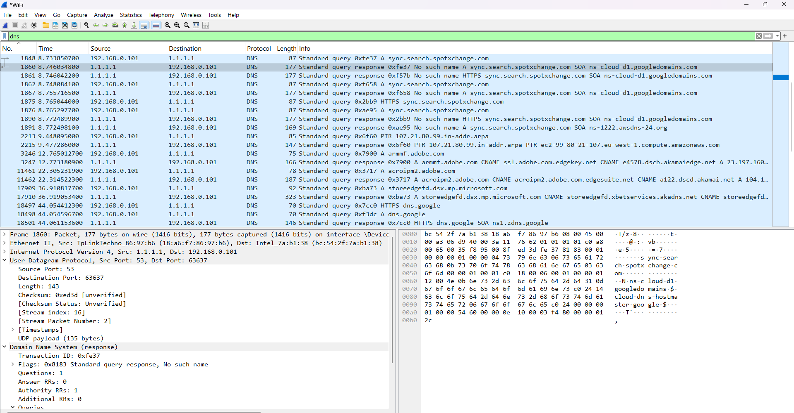

## 8. IPv4 Header Analysis

This screenshot presents the **IPv4 header** of the selected DNS response packet. The IPv4 header contains essential routing information that allows packets to be delivered between hosts across IP networks.

The packet originated from the Cloudflare public DNS resolver (`1.1.1.1`) and was delivered to the local workstation (`192.168.0.101`). The header also includes important fields such as the Internet Header Length (IHL), Total Length, Time To Live (TTL), Flags, and the transport protocol identifier.

### Why It Matters

Inspecting the IPv4 header helps analysts understand how packets are routed through the network. Fields such as the source and destination IP addresses, TTL, fragmentation flags, and protocol number are frequently examined during troubleshooting, threat hunting, and forensic investigations.

### Findings

- The packet was transmitted from the Cloudflare DNS resolver (`1.1.1.1`) to the local workstation (`192.168.0.101`).
- The IPv4 header confirms that the transport protocol is **UDP (Protocol 17)**.
- The packet was not fragmented, as indicated by the **Don't Fragment (DF)** flag.
- The header contains routing information including the source address, destination address, TTL, and total packet length.
- The IPv4 layer successfully encapsulated the UDP payload carrying the DNS response.

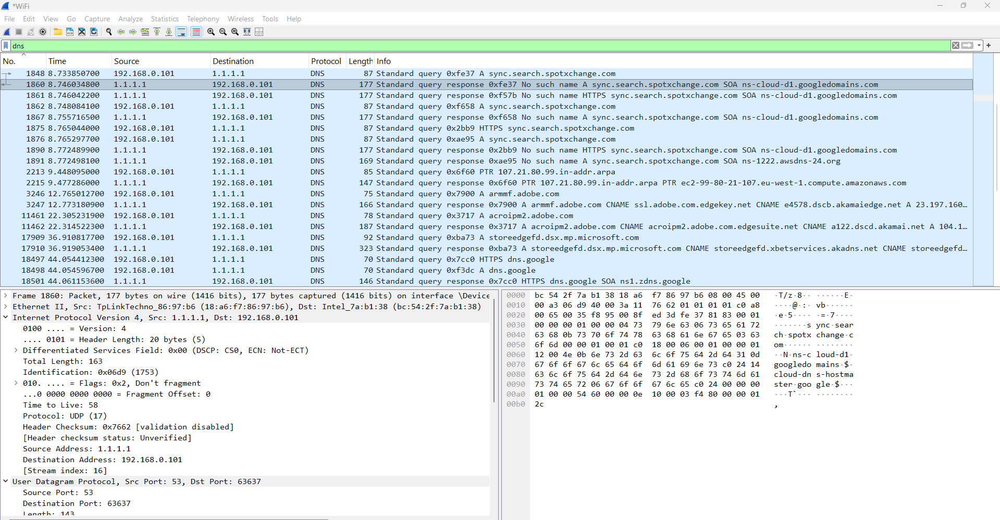

## 9. Ethernet Frame Analysis

This screenshot presents the **Ethernet II frame** of the selected DNS response packet. Ethernet is the Data Link Layer (Layer 2) protocol responsible for delivering frames between devices connected to the same local network.

The frame contains both the **source MAC address** (Cloudflare gateway device) and the **destination MAC address** (the local workstation's network adapter). It also specifies the **EtherType (0x0800)**, indicating that the payload contains an IPv4 packet.

### Why It Matters

Analyzing Ethernet frames helps verify communication at the local network level. MAC addresses identify the physical sender and receiver, while the EtherType field determines which protocol is encapsulated inside the frame.

### Findings

- The packet is encapsulated in an **Ethernet II** frame.
- The **source MAC address** belongs to the network device forwarding traffic from the DNS server.
- The **destination MAC address** belongs to the local workstation.
- The **EtherType value (0x0800)** confirms that the frame carries an IPv4 packet.
- The Ethernet frame successfully encapsulates the IPv4 packet, which in turn contains UDP and DNS data.

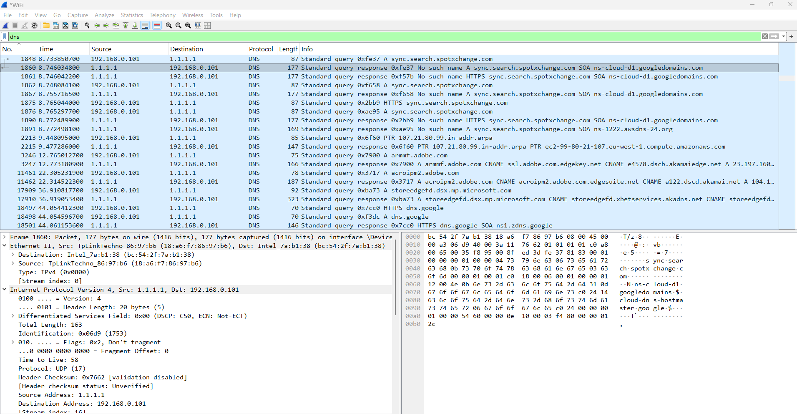

## 10. DNS Authority Section

This screenshot presents the **DNS response** for the selected query. The response returned the status **"No such name" (NXDOMAIN)**, indicating that the requested domain could not be resolved.

The packet includes an **Authority Record (SOA – Start of Authority)**, which identifies the authoritative DNS server responsible for the queried domain. Instead of returning an IP address, the DNS server provides information about the zone authority.

### Why It Matters

The Authority section is included when a DNS server needs to indicate which server is responsible for a domain. This information is useful for troubleshooting DNS resolution problems and understanding how DNS delegation works.

### Findings

- The DNS response returned **NXDOMAIN ("No such name")**.
- No Answer Records were returned.
- One **Authority Record (SOA)** is present.
- The authoritative nameserver is **ns-cloud-d1.googledomains.com**.
- The queried domain was **sync.search.spotxchange.com**.

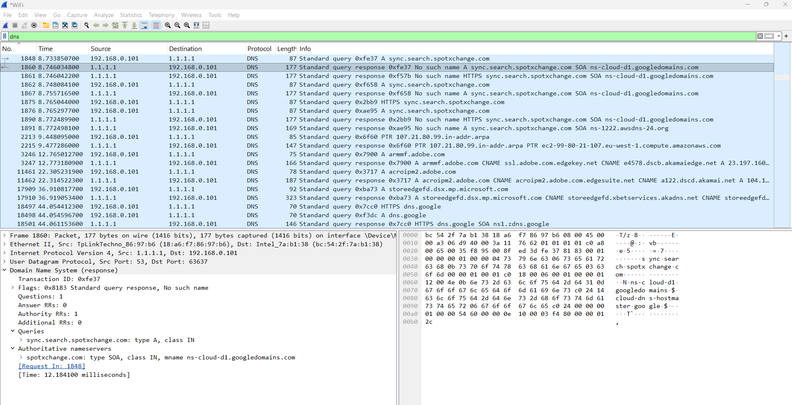

## 11. I/O Graph Analysis

This screenshot presents the **Wireshark I/O Graph**, which visualizes network traffic over time. The graph shows the packet rate captured during the monitoring session, making it easier to identify traffic peaks and communication patterns.

The black line represents all captured packets, while the DNS display filter was enabled to observe DNS-related activity. Small red bars indicate TCP analysis events detected by Wireshark.

### Why It Matters

The I/O Graph provides a quick overview of network activity and helps identify bursts of traffic, abnormal behavior, or periods of increased communication. It is a useful tool for performance monitoring and troubleshooting.

### Findings

- Traffic intensity changes throughout the capture period.
- Several short peaks indicate bursts of network activity.
- DNS traffic is visible during the capture.
- Only a few TCP analysis events were detected.
- No sustained abnormal traffic pattern or denial-of-service behavior was observed.

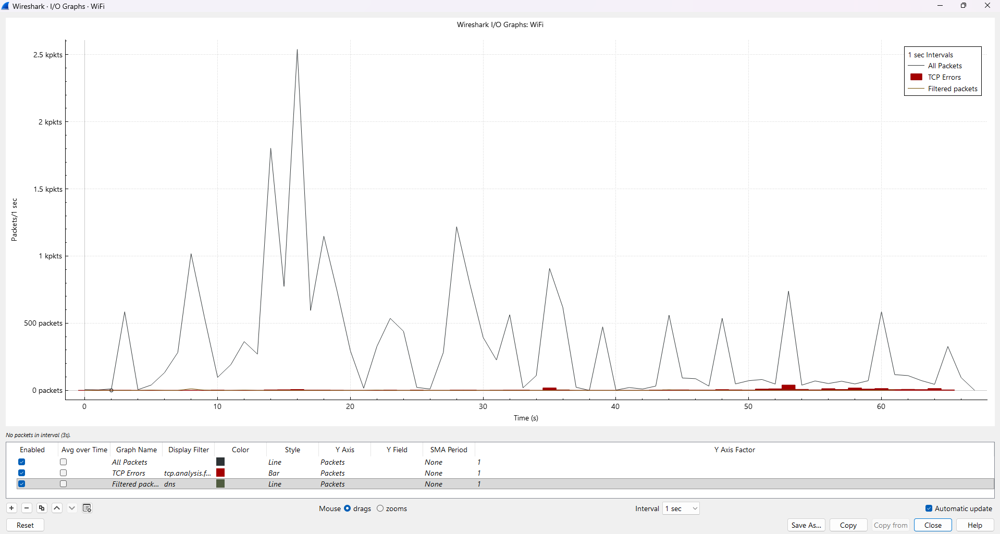

## 12. DNS Flags Analysis

This screenshot presents the **DNS header flags** contained in the selected DNS response packet. These flags describe how the DNS server processed the request and provide additional information about the response.

The response indicates that the requested domain could not be resolved, returning the DNS reply code **NXDOMAIN (No such name)**.

### Why It Matters

DNS flags are essential for understanding how a DNS query was handled. They reveal whether the message is a query or response, if recursion was requested and supported, and whether the lookup was successful.

### Findings

- The packet is a **DNS response**.
- The **Opcode** is **Standard Query**.
- **Recursion Desired (RD)** is enabled.
- **Recursion Available (RA)** confirms that recursive queries are supported by the DNS server.
- The **Reply Code (RCODE)** is **3 (NXDOMAIN – No such name)**.
- The response contains no Answer Records but includes an Authority Record identifying the authoritative DNS server.

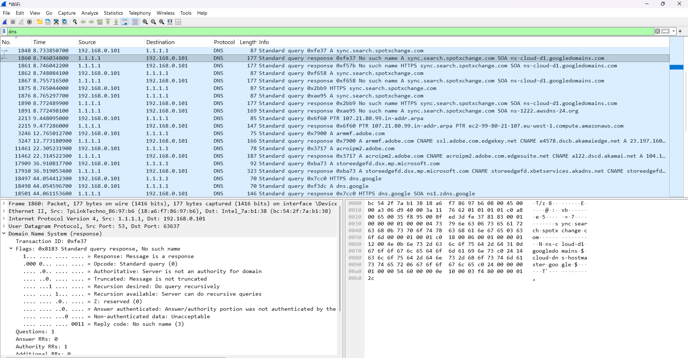

---

## 🔬 Methodology

The analysis followed the following workflow:

1. Capture live network traffic.
2. Apply DNS display filter.
3. Identify communication endpoints.
4. Examine protocol hierarchy.
5. Inspect packet headers.
6. Analyze DNS queries and responses.
7. Document observations.

---

## Key Findings

The analysis confirmed normal DNS communication between the local workstation and the Cloudflare public DNS resolver.

No suspicious traffic, protocol anomalies, or unexpected communication patterns were identified during the capture.

The captured traffic demonstrates the complete DNS resolution process, including query generation, response processing, endpoint communication, and protocol encapsulation across the Ethernet, IPv4, UDP, and DNS layers.

---

## Lessons Learned

During this project I learned how to:

- Capture live traffic using Wireshark
- Filter DNS traffic efficiently
- Analyze protocol hierarchy
- Inspect Ethernet, IPv4 and UDP headers
- Correlate DNS queries with responses
- Interpret Wireshark statistics
- Document network analysis findings

---

## Future Improvements

Future projects will focus on:

- Malware PCAP analysis
- HTTP/HTTPS traffic analysis
- DNS tunneling detection
- Command and Control (C2) traffic investigation
- Network forensics

---
